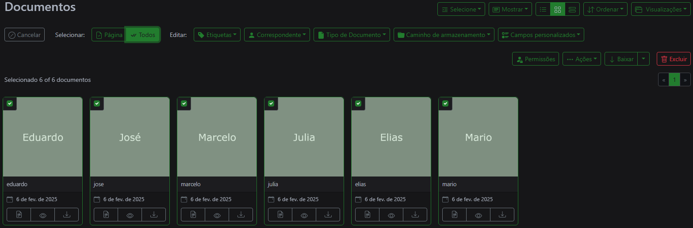
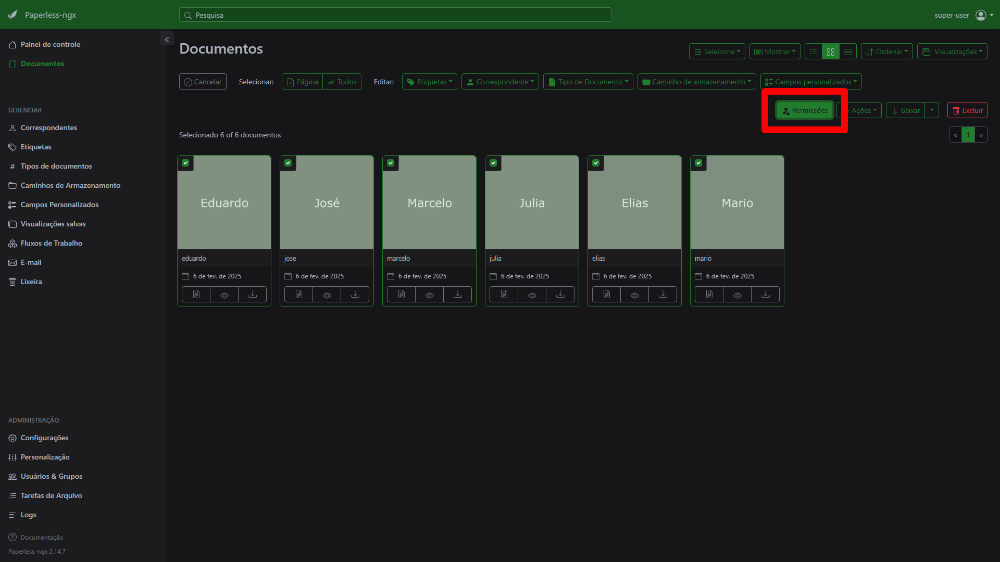

# Paperless-ngx

## Sobre

O Paperless-ngx é  um sistema de gerenciamento de documentos de código aberto que transforma seus documentos físicos em um arquivo on-line pesquisável

### Features

Principais features:

- Organizar e indexar os documentos escaneados com tags, correspondentes, tipos e muitos outros
- Os dados são armazenados num servidor local
- Executa OCR nos documentos
- Reconhece mais de 100 idiomas
- Os documentos são salvos em PDF juntos dos arquivos originais inalterados
- Suporta vários tipos de arquivo (desde PDFs ou imagens até documentos Office)

## Instalação

### Docker

É necessário ter o [**Docker**](https://docs.docker.com/desktop/setup/install/windows-install/) instalado e configurar o compose.

### Arquivos GitHub

Baixe os arquivos [*docker-compose.sqlite-tika.yml*](https://github.com/paperless-ngx/paperless-ngx/blob/main/docker/compose/docker-compose.sqlite-tika.yml), [*docker-compose.env*](https://github.com/paperless-ngx/paperless-ngx/blob/main/docker/compose/docker-compose.env), [*.env*](https://github.com/paperless-ngx/paperless-ngx/blob/main/docker/compose/.env).

### Configuração do *docker-compose.yml*

Para Configurar este arquivo, é necessário renomear o nome de ***docker-compose.sqlite-tika.yml*** para ***docker-compose.yml***. Após esse processo, é necessário setar alguns valores em *volumes* dentro de *webserver*

Antes:

```yml
volumes:
    - data:/usr/src/paperless/data
    - media:/usr/src/paperless/media
    - ./export:/usr/src/paperless/export
    - ./consume:/usr/src/paperless/consume
```

Depois:

```yml
volumes:
    - <Pasta salva do usuário>/data:usr/src/paperless/data
    - <Pasta salva do usuário>/media:/usr/src/paperless/media
    - <Pasta salva do usuário>/export:/usr/src/paperless/export
    - <Pasta salva do usuário>/consume:/usr/src/paperless/consume
```

### Baixando as imagens com o Docker

Script para baixar as imagens do Paperless no diretório em que se encontra o compose.

```bash
docker-compose pull
```

### Configuração de servidor web

Script para configurar o usuário e a senha para o servidor web.

```bash
docker-compose run --rm webserver createsuperuser
```

## Execução do serviço

Script para inicializar o serviço.

```bash
docker-compose up -d
```

Para acessar o serviço, é necessário acessar atráves da porta *8000*: [localhost:8000/dashboard](https://localhost:8000/dashboard)

# Fluxo

## Envio de arquivos

Para abrir o(s) arquivo(s) é necessário clicar em **Navegar arquivos.


## Definição de permissões

Para definir permissões dentro **Paperless-ngx** é necessário criar *grupos* e configurar as permissões de vizualização.

### Criação de *grupos* e *tags*

1. Siga até a seção ***Usuários e Grupos*** na barra lateral


2. crie um grupo e configure como quiser

> Obs.: selecione a opção de vizualização *UISettings* ou selecione todas


3. Crie as tags

Selecione a aba ***Etiquetas*** na barra lateral.


E configure a tag.


### Definindo as permissões

1. Selecione os documentos desejados



2. Clique em ***Permissões***



3. Configure as permissões

> Obs.: o admin que estiver setando as configurações **precisa** definir um proprietário, se não a vizulização é totalmente sem restrições


A seção ***Ver*** e ***Editar*** contém usuários ou grupos. Estes tópicos servem para definir quem ou qual grupo vizualizar certos documentos.

### Fluxos de trabalho

O fluxo de trabalho é separado entre **gatilhos** e **ações**.

1. Vá até **Fluxos de trabalho**


2. Configure os fluxos de trabalho definindo os gatilhos e as ações


## Referências

1. [Setup - Paperless-ngx | Paperless-ngx](https://docs.paperless-ngx.com/setup/)

2. [DMS Paperless NGX with Docker in Windows Installation, Instructions & Tips [EN] | YouTube](https://www.youtube.com/watch?v=kRH0nPRcRMY)
